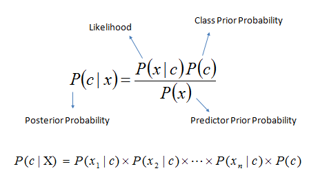

    <h1>TUGAS BESAR PEMODELAN DAN SIMULASI</h1>
    <h1>KLASIFIKASI KEMISKINAN DENGAN TEORI NAIVE BAYES CLASSIFIER</h1>

  
  

    

        
    

  
  

    <h2>Disusun Oleh:</h2>
    <h2>Surya Herdianto Utomo (F1D021068)</h2>
    <h2>Faras Ayuandira (F1D021088)</h2>
    <h2>Lalu Abdul Gofururrohiem (F1D021098)</h2>

    
    

    <h2>UNIVERSITAS MATARAM</h2>
    <h2>FAKULTAS TEKNIK</h2>
    <h2>TEKNIK INFORMATIKA</h2>
    <h2>2023/2024</h2>

    
    
    
    

